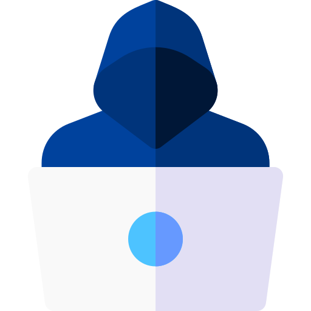

# SOC IN MY POCKET

[![Contributors][contributors-shield]][contributors-url]
[![Forks][forks-shield]][forks-url]
[![Stargazers][stars-shield]][stars-url]
[![Issues][issues-shield]][issues-url]
[![MIT License][license-shield]][license-url]
[![LinkedIn][linkedin-shield]][linkedin-url]

<!-- PROJECT LOGO -->
 

  

<h3 align="center">SOC Analyst</h3>

  

   To be a part of y'all
     
    <a href="https://github.com/phamthanhsang-cs/SOC-in-my-Pocket"><strong>Explore the docs »</strong></a>
     
     
    <a href="https://github.com/phamthanhsang-cs/SOC-in-my-Pocket">My Demo</a>
    ·
    <a href="https://github.com/phamthanhsang-cs/SOC-in-my-Pocket/issues/new?labels=bug&template=bug-report---.md">Your Suggestion / Review</a>
    ·
    <a href="https://github.com/phamthanhsang-cs/phamthanhsang-cs">Other Projects</a>
  

<!-- TABLE OF CONTENTS -->

  
Table of Contents

  <ol>
    <li>
      <a href="#about-the-project">About The Project</a>
      <ul>
        <li><a href="#built-with">Built With</a></li>
      </ul>
    </li>
    <li>
      <a href="#introduction">Introduction</a>
      <ul>
        <li><a href="#prerequisites">Prerequisites</a></li>
        <li><a href="#adversary-emulation">Adversary Emulation</a></li>
      </ul>
    </li>
    <li><a href="#incident-response">Incident Response</a></li>
    <li><a href="#lets-go">Let's go</a></li>
    <li><a href="#contributing">Contributing</a></li>
    <li><a href="#contact">Contact</a></li>
  </ol>

<!-- ABOUT THE PROJECT -->
## About The Project

 
  

 
  Bird's Eye View of my SOC Infrastructure (Oct/2024)

(<a href="#readme-top">back to top</a>)

### Built With

* [![OPNSense][OPNSense]][OPNSense-url]
* [![Elastic][Elastic]][Elastic-url]
* [![Shuffle][Shuffle]][Shuffle-url]
* [![Cortex][Cortex]][Cortex-url]
* [![TheHive][TheHive]][TheHive-url]
* [![MISP][MISP]][MISP-url]
* [![OpenCTI][OpenCTI]][OpenCTI-url]
* [![AtomicRedTeam][AtomicRedTeam]][AtomicRedTeam-url]

(<a href="#readme-top">back to top</a>)

<!-- GETTING STARTED -->
## Introduction

**SOC in My Pocket (SOCIMP)** is my very first and flagship cybersecurity project so far. This basic SOC project is designed for **Security and SOC Analysts**, centered around the core pillars of **People, Process, and Technologies (PPT)** – the foundation of effective SOC operations.

By focusing on adversaries' **Tactics, Techniques, and Procedures (TTPs)** for threat detection and response, SOCIMP helps me learn how to proactively defend against complex cyber threats. 

With its advanced monitoring, automation, and response capabilities, this SOC setup showcases my knowledge of cybersecurity and reflects my vision of a safer digital world for everyone.

### Prerequisites
***2 THINGS: ME AND A DEDICATED WORKSTATION***

Since SOCIMP includes essential SOC components designed to deliver comprehensive cybersecurity operations:

- **SIEM**: The Elastic Stack is my SIEM solution of choice. All logs and data sources (Workstations: Windows/Linux, Servers, Firewalls, Cloud, Web Applications, etc.) are forwarded into the Elastic Stack and centrally managed through a Fleet Server.
  
- **EDR**: Elastic Agent, integrated with Elastic Defend, provides robust endpoint detection and response (EDR) capabilities that work seamlessly within the Elastic ecosystem.

- **SOAR**: Tools like **Shuffle**, **TheHive**, and **Cortex** offer high levels of automation, flexibility, and extensive integration across various components for streamlined security operations and incident response.

- **TIP**: **MISP** is a powerful threat intelligence platform that integrates smoothly with TheHive and Cortex for effective incident enrichment. **OpenCTI** enhances this with visually rich dashboards and multiple connectors to gather comprehensive threat intelligence data.

- **Firewall**: I opted for **OPNSense**, which offers a user-friendly dashboard, advanced traffic inspection, and a variety of built-in security features to protect the network.

To serve those things, the SOCIMP project is built on a Workstation powered by:
- **CPU**: Intel Xeon (18 cores / 36 threads)
- **RAM**: 96 GB
- **Storage**: 1 TB SSD

This infrastructure hosts multiple VMs and containers, ensuring scalability and performance across all SOC components.

(<a href="#readme-top">back to top</a>)

## Adversary Emulation

For **adversary emulation**, I chose to use **[Atomic Red Team](https://atomicredteam.io/)**. It’s lightweight, portable, and allows me to quickly test my environment.

*In the future, I may also explore **[Caldera](https://caldera.mitre.org/)** for more advanced adversary simulation capabilities.*

(<a href="#readme-top">back to top</a>)

## Incident Response

For incident response, I rely on the well-structured **NIST Framework** to handle security incidents effectively. This framework provides a standardized approach, ensuring a thorough and consistent response to potential security threats. The NIST Incident Response Lifecycle includes four main stages:

1. **Preparation** – Establishing and maintaining an incident response capability. This involves creating an incident response policy, identifying resources, and training the response team.

2. **Detection and Analysis** – Monitoring systems to detect suspicious activities and analyzing potential incidents. This stage focuses on identifying and validating incidents accurately to minimize false positives.

3. **Containment, Eradication, and Recovery** – Limiting the impact of the incident, eliminating the root cause, and restoring systems to normal operation. This stage is crucial for controlling the spread and impact of the incident on the organization.

4. **Post-Incident Activity** – Learning from the incident to improve future responses. This involves documenting the incident, conducting a post-mortem analysis, and updating policies and procedures.

See more details on **[NIST Framework Incident Response](https://github.com/phamthanhsang-cs/SOC-in-my-Pocket/blob/main/external-documents/NIST-Framework-for-IR.pdf)**. Following this structured approach allows me to respond to incidents efficiently and continuously improve my SOCIMP project’s security posture.

*NOTE: You could follow SANS Framework instead or maybe both dependancy*

(<a href="#readme-top">back to top</a>)

## Let's Go

In the **SOCIMP** project, I will guide you through all stages, starting with **installation notes**, followed by the **deployment** where i *config* and *integrate* all components, **preparation for adversary emulation**, and **threat hunting, analysis, response to security incidents** (blue teaming). 

*This project will also cover future development plans.*

* [Installation Notes](https://github.com/phamthanhsang-cs/SOC-in-my-Pocket/tree/main/installation-notes): My setup processes, challenges encountered, and troubleshooting techniques for various components.
* [Deployment](https://github.com/phamthanhsang-cs/SOC-in-my-Pocket/tree/main/deployment): Procedures for deploying and integrating tools to create a functional SOC infrastructure.
* [Adversary Emulation]: How i setting up adversary environments, building attack plans, and replicating real-world behaviors using the MITRE ATT&CK Framework.
* [**Blue Teaming**]: Processes for monitoring alerts, detecting threats, and responding to incidents. This is the location that you might need to see since its the main part of my project and also **WHY I'M HERE** ! 

(<a href="#readme-top">back to top</a>)

<!-- CONTRIBUTING -->
## Contributing

(<a href="#readme-top">back to top</a>)

### Top contributors:

<!-- CONTACT -->
## Contact

[Pham Thanh Sang](https://www.linkedin.com/in/phamthanhsang0311/) - [@telegram](https://t.me/sangpham0311) - sang3112002@gmail.com

Project Link: [https://github.com/phamthanhsang-cs/SOC-in-my-Pocket](https://github.com/phamthanhsang-cs/SOC-in-my-Pocket)

(<a href="#readme-top">back to top</a>)

<!-- MARKDOWN LINKS & IMAGES -->
<!-- https://www.markdownguide.org/basic-syntax/#reference-style-links -->
[contributors-shield]: https://img.shields.io/github/contributors/phamthanhsang-cs/SOC-in-my-Pocket.svg?style=for-the-badge
[contributors-url]: https://github.com/phamthanhsang-cs/SOC-in-my-Pocket/graphs/contributors
[forks-shield]: https://img.shields.io/github/forks/phamthanhsang-cs/SOC-in-my-Pocket.svg?style=for-the-badge
[forks-url]: https://github.com/phamthanhsang-cs/SOC-in-my-Pocket/network/members
[stars-shield]: https://img.shields.io/github/stars/phamthanhsang-cs/SOC-in-my-Pocket.svg?style=for-the-badge
[stars-url]: https://github.com/phamthanhsang-cs/SOC-in-my-Pocket/stargazers
[issues-shield]: https://img.shields.io/github/issues/phamthanhsang-cs/SOC-in-my-Pocket.svg?style=for-the-badge
[issues-url]: https://github.com/phamthanhsang-cs/SOC-in-my-Pocket/issues
[license-shield]: https://img.shields.io/github/license/phamthanhsang-cs/SOC-in-my-Pocket.svg?style=for-the-badge
[license-url]: https://github.com/phamthanhsang-cs/SOC-in-my-Pocket/blob/master/LICENSE.txt
[linkedin-shield]: https://img.shields.io/badge/-LinkedIn-black.svg?style=for-the-badge&logo=linkedin&colorB=555
[linkedin-url]: https://www.linkedin.com/in/phamthanhsang0311/
[OPNSense]: https://img.shields.io/badge/OPNSense-%23FF5200.svg?style=for-the-badge&logo=opnsense&logoColor=white
[OPNSense-url]: https://opnsense.org/
[Elastic]: https://img.shields.io/badge/Elastic-%23005571.svg?style=for-the-badge&logo=elastic&logoColor=white
[Elastic-url]: https://www.elastic.co/
[Shuffle]: https://img.shields.io/badge/Shuffle-%23FF6F00.svg?style=for-the-badge&logo=hackthebox&logoColor=white
[Shuffle-url]: https://shuffler.io/
[Cortex]: https://img.shields.io/badge/Cortex-%2380F5D2.svg?style=for-the-badge&logo=serverless&logoColor=white
[Cortex-url]: https://strangebee.com/cortex/
[TheHive]: https://img.shields.io/badge/TheHive-%23FFCD00.svg?style=for-the-badge&logo=hive&logoColor=white
[TheHive-url]: https://strangebee.com/thehive/
[MISP]: https://img.shields.io/badge/MISP-%23248BFB.svg?style=for-the-badge&logo=wechat&logoColor=white
[MISP-url]: https://www.misp-project.org/
[OpenCTI]: https://img.shields.io/badge/OpenCTI-%23003399.svg?style=for-the-badge&logo=nextdns&logoColor=white
[OpenCTI-url]: https://filigran.io/solutions/open-cti/
[AtomicRedTeam]: https://img.shields.io/badge/AtomicRedTeam-%23FF0000.svg?style=for-the-badge&logo=wagtail&logoColor=white
[AtomicRedTeam-url]: https://atomicredteam.io/
